
<h1 align="center">供应商管理系统</h1>

## 简介
供应商管理系统，基于Spring Boot开发，角色包含管理员和用户；功能模块涵盖供应商信息管理、商品管理、出入库管理、退货管理、公告管理，支持新增、查询、修改、删除和详细查看操作，适合毕业设计演示。    --计算机毕业设计源码；毕设源码；java毕业设计源码

## 联系方式

<h3 align="center">获取完整代码与数据库文件 + 微信：deepguan QQ: 86050149 QQ群: 783742310</h3>

<h3 align="center">可帮忙远程部署 包运行成功！提供远程部署、修改代码、设计文档指导、代码讲解等服务！</h3>

## 功能介绍（完整见运行截图）
管理员： 系统提供全面的管理功能模块，包括供应商信息管理、商品管理、出入库管理、员工管理、公告管理等。管理员可以通过系统界面进行登录、退出操作，并管理供应商信用评级、商品库存、订单信息等。公告管理模块允许管理员新增、查看、修改和删除公告信息。

供应商： 供应商可以通过系统上传和管理其信息，包括基本信息输入如名称、联系人、联系电话及地址。供应商还可以访问和管理商品信息、查看进货记录、退货类型等。此外，对于出入库单及相关订单，供应商有权限编辑和更新数据。

操作员： 系统操作员主要负责商品入库和出库管理。他们可以根据授权，通过界面执行商品信息的录入、修改、以及库存数量调整和状态更新。此外，操作员负责利用查询功能管理商品进货、退货以及出入库记录的查看和处理。

用户： 系统为普通用户提供简洁友好的信息查询接口，用户可以查看商品信息、供应商列表及公告内容。此外，用户可以使用基本功能如系统登录和退出，同步个人中心信息，通过系统侧边导航栏快速访问不同模块，进行有效的互动管理操作。

## 运行截图
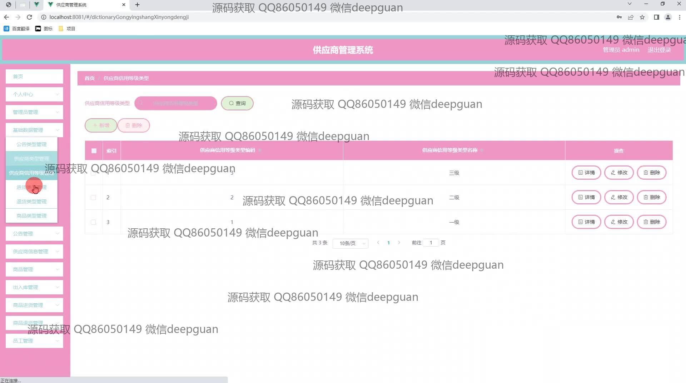
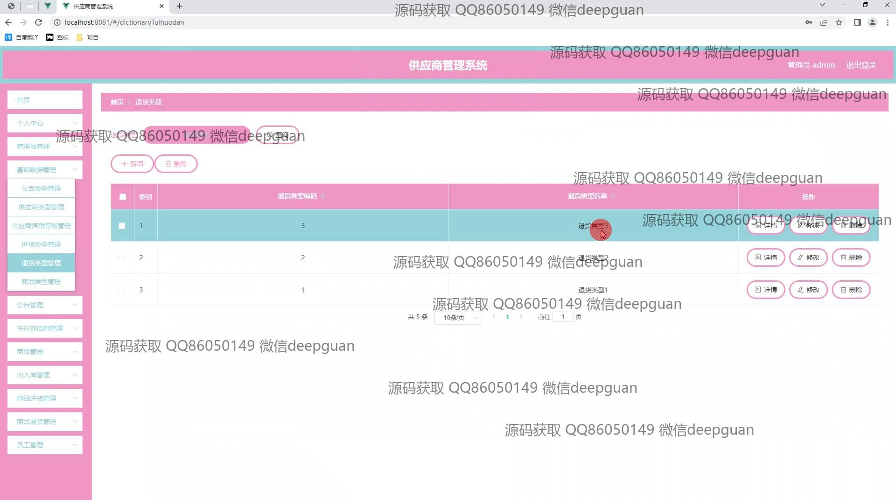
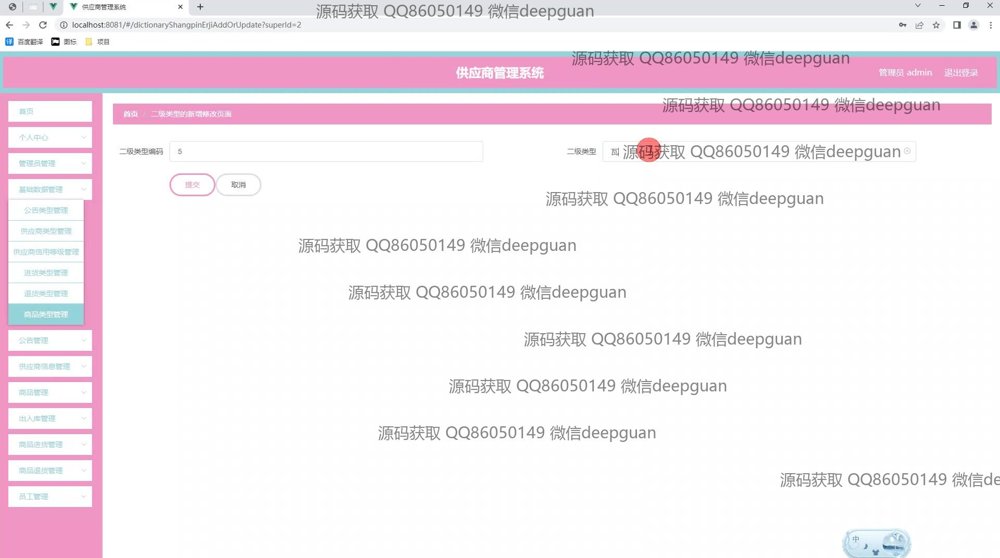
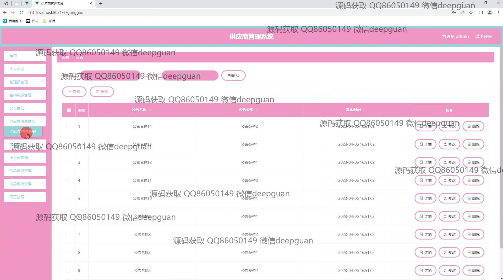
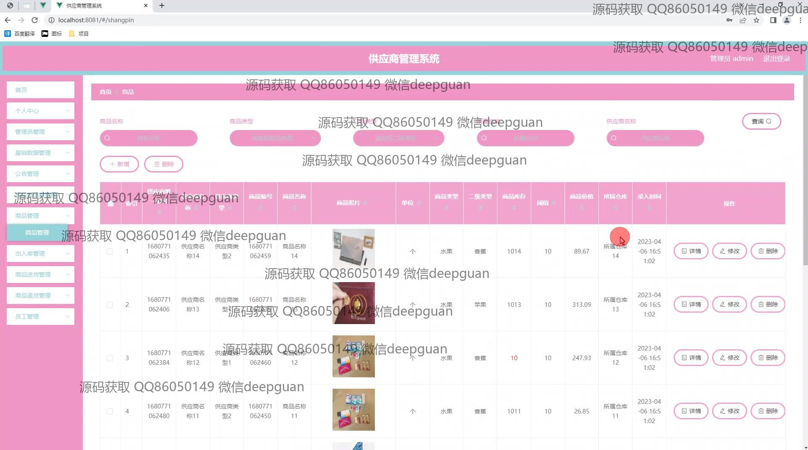
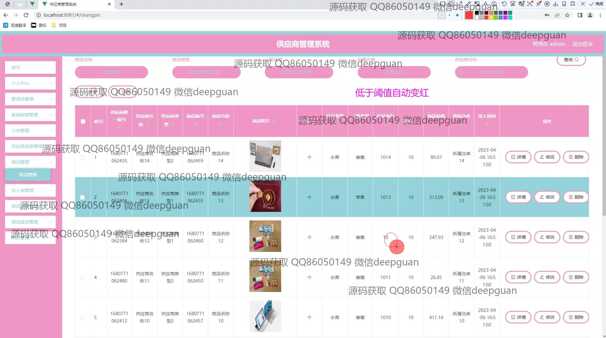
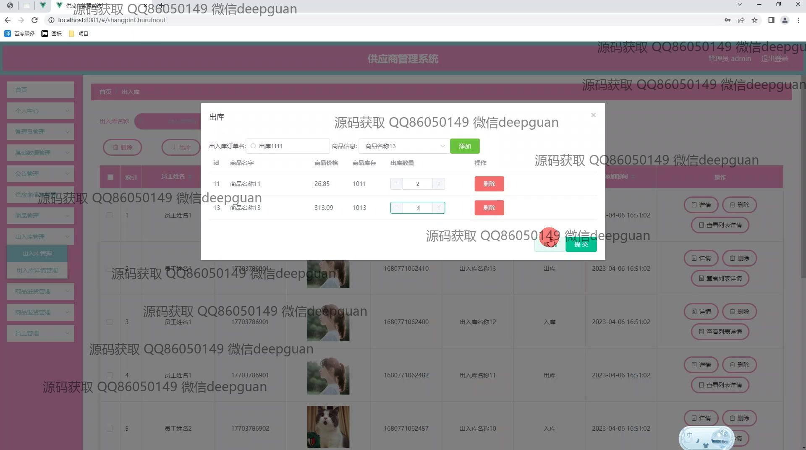
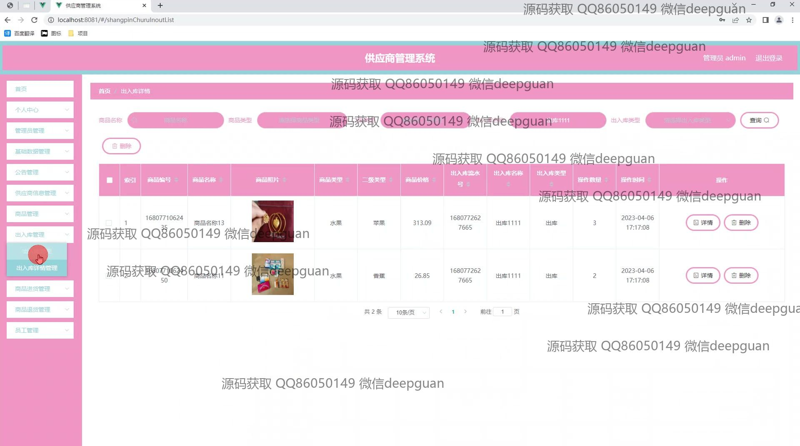
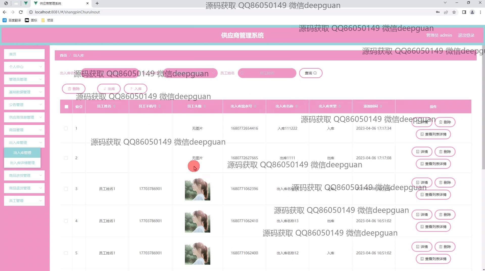
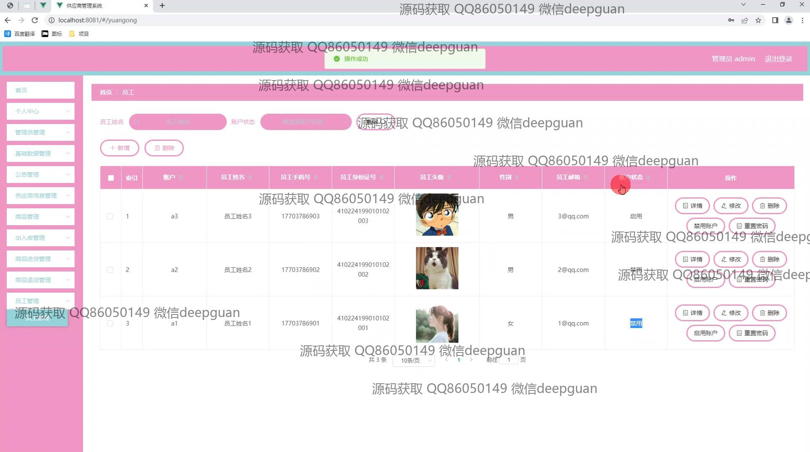
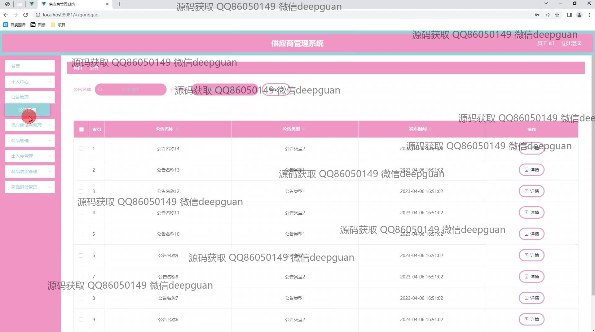
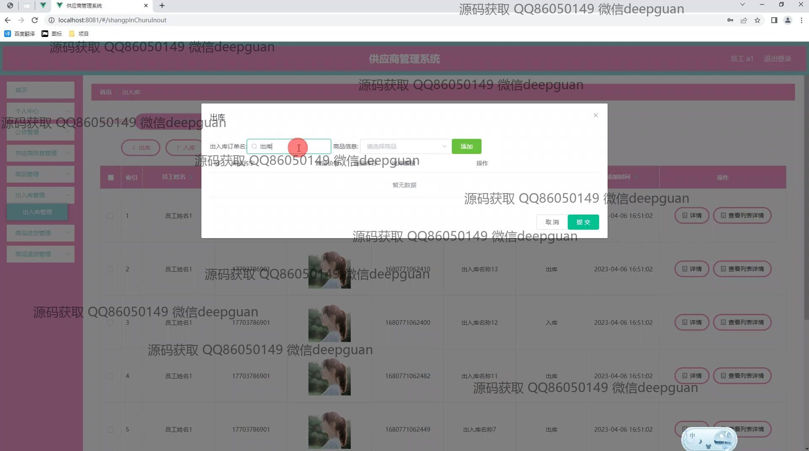
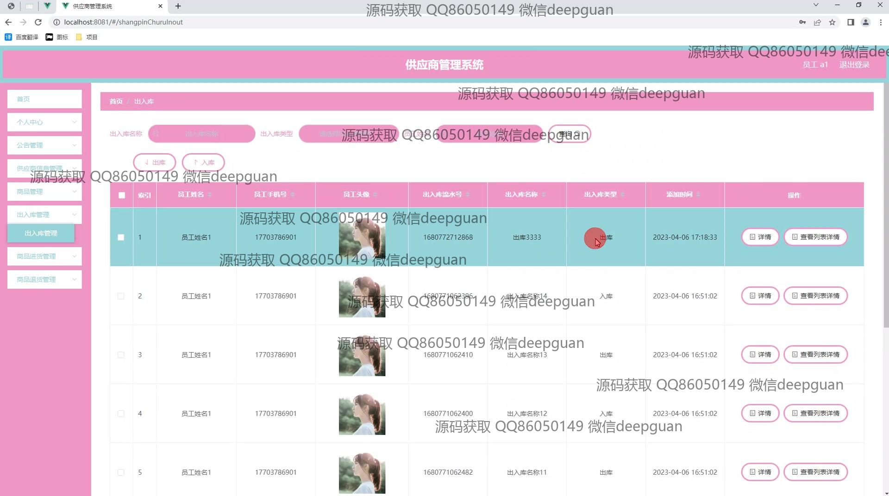
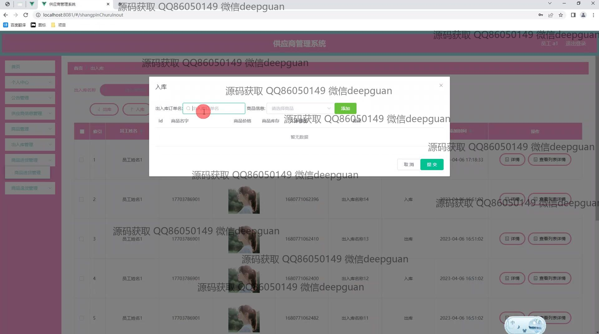
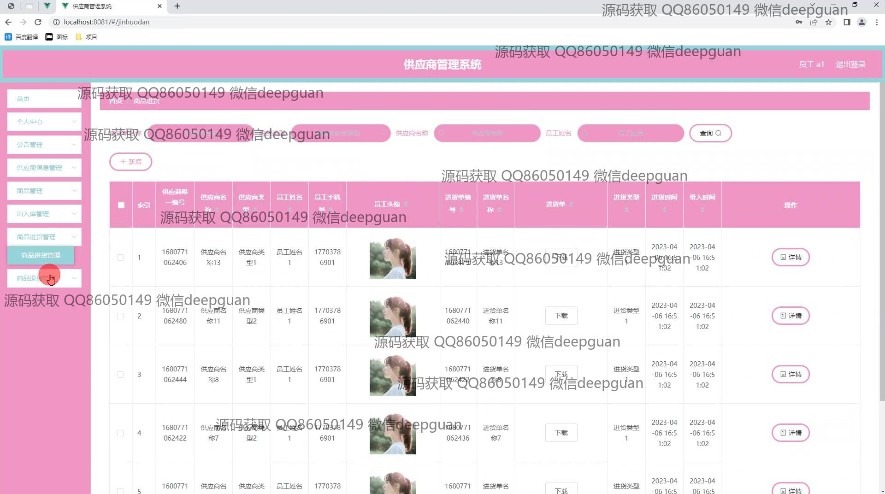
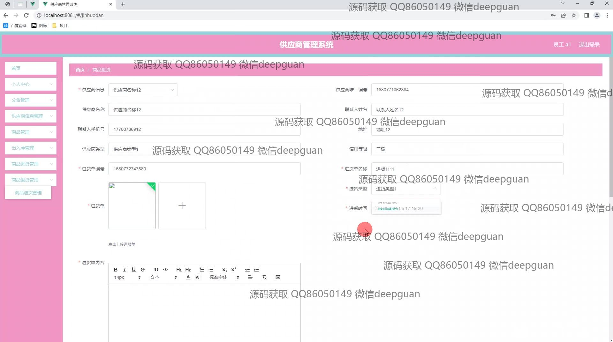
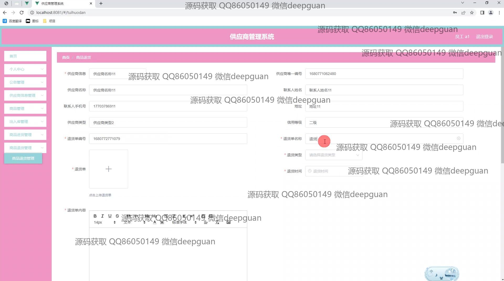
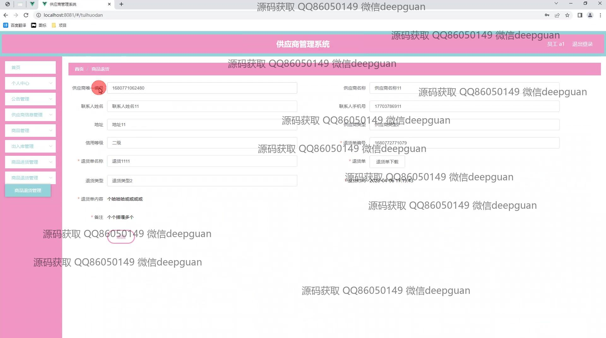

本代码来源于网络,仅供学习参考使用!

